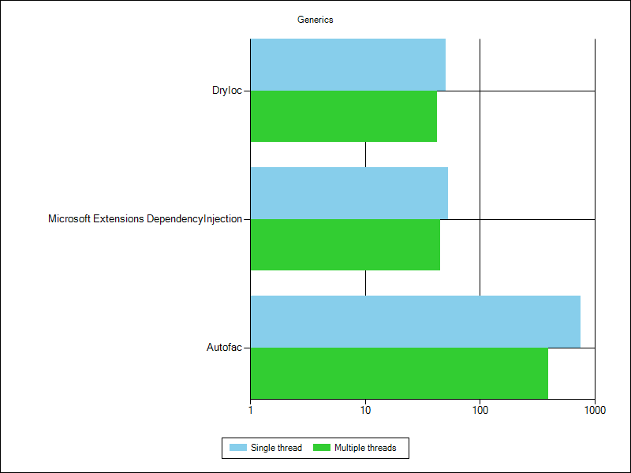

# Производительность IoC

Сравниваем 3 контейнера:

* [**Autofac**](https://github.com/autofac/Autofac)  - 7.0.1 
* [**DryIoC**](https://github.com/dadhi/DryIoc)  -  5.3.4
* [**Microsoft.DependencyInjections**](https://github.com/dadhi/DryIoc) - 7.0.0

## Конфигурация запуска 

*Runtime* запуска тестов - .Net6

Бенчмарки выполняются на следующей конфигурации машины

* *CPU*: Intel(R) Core(TM) i9-12900F   2.40 GHz

* *Memory*: 32 GB

## Список бенчмарков

Код бенчмарков взят [отсюда](https://github.com/danielpalme/IocPerformance).

- Singleton: Создание синглетон-объекта Objects with is singleton lifetime are resolved
- Transient: Создание объекта по запросу Objects with is transient lifetime are resolved
- Combined: Создание синглетона и по запросу
- Complex: Создание сложного объекта со вложенностями
- Property: Инжекция зависимости через свойство
- Generics: Создание Generic-класса
- IEnumerable: Создание множества объектов, реализующих один интерфейс
- Conditional: Создание объекта по условию
- Child Container: Создание объекта через дочерний контейнер
- ASP NET Core: Создание объектов при интеграции его в ASP NET Core приложении
- Prepare And Register: Инициализация и регистрация контейнера (3000 раз)
- Prepare And Register And Simple Resolve: Инициализация и регистрация контейнера. Плюс создание двух объектов ( 3000 раз) 

Каждый тест запускается однопоточно и многопоточно. 

## Результаты

### Базовые возможности
| **Container**                                                |     **Singleton** |     **Transient** |      **Combined** |       **Complex** |
| :----------------------------------------------------------- | ----------------: | ----------------: | ----------------: | ----------------: |
| **[Autofac 7.0.1](https://github.com/autofac/Autofac)**      |       359 167 |       373 200 |       916 488 |     2771 1404 |
| **[DryIoc 5.3.4](https://github.com/dadhi/DryIoc)**          | **34** **29** | **43** **42** | **53** **53** |     75 **58** |
| **[Microsoft Extensions DependencyInjection 7.0.0](https://github.com/aspnet/Extensions)** |     **34** 37 |         45 55 |         55 64 | **73** **58** |

### Дополнительные возможности
| **Container**                                                |       **Property** |      **Generics** |    **IEnumerable** |   **Conditional** |    **Child Container** |    **Asp Net Core** |
| :----------------------------------------------------------- | -----------------: | ----------------: | -----------------: | ----------------: | ---------------------: | ------------------: |
| **[Autofac 7.0.1](https://github.com/autofac/Autofac)**      |      2844 1489 |       749 396 |      2824 2321 |      1159 700 | **35443** **9236** |      13735 7124 |
| **[DryIoc 5.3.4](https://github.com/dadhi/DryIoc)**          | **111** **76** | **50** **42** | **155** **96** | **53** **44** |                    | **751** **465** |
| **[Microsoft Extensions DependencyInjection 7.0.0](https://github.com/aspnet/Extensions)** |                |         53 45 |        162 101 |               |                    |        1116 632 |

### Подготовка контейнера
| **Container**                                                | **Prepare And Register** | **Prepare And Register And Simple Resolve** |
| :----------------------------------------------------------- | -----------------------: | ------------------------------------------: |
| **[Autofac 7.0.1](https://github.com/autofac/Autofac)**      |                  98  |                                    109  |
| **[DryIoc 5.3.4](https://github.com/dadhi/DryIoc)**          |                  13  |                                     14  |
| **[Microsoft Extensions DependencyInjection 7.0.0](https://github.com/aspnet/Extensions)** |               **8**  |                                 **11**  |

### Графики

